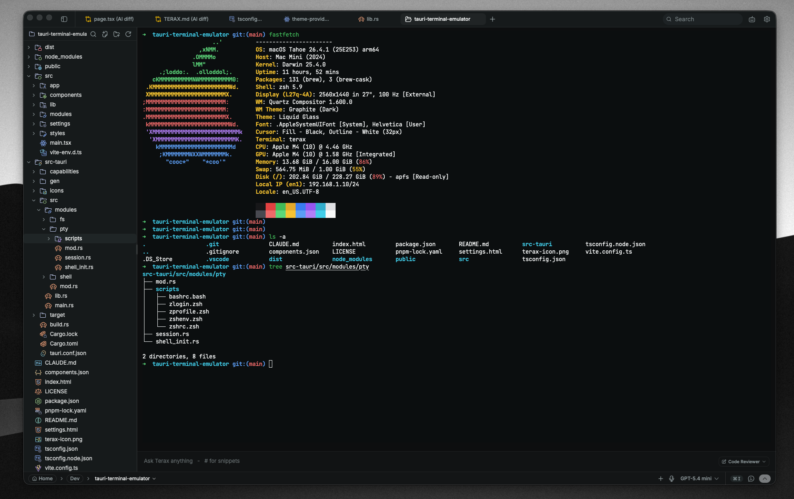
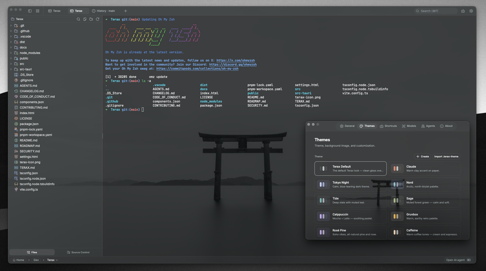
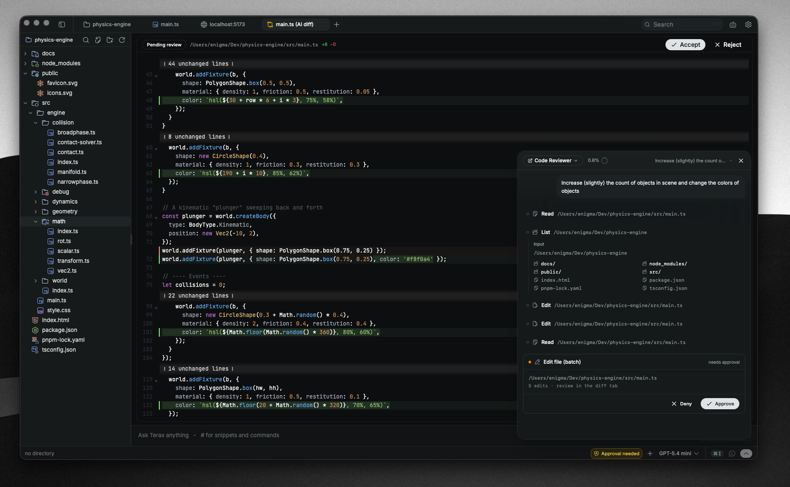

<div align="center">
  
  <h1>Yamet</h1>

  <p><strong>轻量级、终端优先的 AI 原生开发工作台。</strong></p>

  <p>
    
  </p>
</div>

---

Yamet 是一个开源、轻量的终端（ADE，agentic development environment），基于 Tauri 2 + Rust 与 React 19 构建。原生 PTY 后端配合 WebGL 渲染器，内置可接自有密钥或完全本地模型的 agentic AI 侧面板，以及代码编辑器、文件浏览器、带 git 图的源码管理、网页预览面板。磁盘占用约 7-8 MB。无遥测、无账号。

## 截图

<table>
  <tr>
    <td align="center"><br/><sub>WebGL 渲染的多标签终端</sub></td>
    <td align="center"><br/><sub>自定义主题、预设与背景图片</sub></td>
  </tr>
  <tr>
    <td align="center"><br/><sub>本地开发服务器网页预览</sub></td>
    <td align="center"><br/><sub>带历史 git 图的源码控制面板</sub></td>
  </tr>
  <tr>
    <td colspan="2" align="center"><br/><sub>带编辑器 diff 的 agentic AI 工作流</sub></td>
  </tr>
</table>

## 功能特性

### 终端

- 基于 xterm.js 的 WebGL 渲染器，多标签 + 后台流式输出
- GPU 加速的块状终端，编辑器式命令输入
- 通过 `portable-pty` 的原生 PTY 后端（zsh、bash、pwsh、fish、cmd）
- 分屏面板（横向与纵向）
- 行内搜索、链接识别、真彩色
- Windows 上按标签独立的工作区环境（本地或任意已装 WSL 发行版）

### 代码编辑器

- CodeMirror 6（支持所有主流语言：TS/JS、Rust、Python、Go、C/C++、Java、HTML/CSS、JSON、Markdown 等）
- 支持本地模型的行内 AI 自动补全
- AI 编辑 diff，逐块接受或拒绝
- Vim 模式
- 十款内置编辑器主题：Atom One、Aura、Copilot、GitHub Dark/Light、Gruvbox Dark、Nord、Tokyo Night、Xcode Dark/Light

### 源码管理

- 逐块暂存/取消暂存、提交（Cmd+Enter / Ctrl+Enter）、感知上游的推送
- 分支展示（含 detached HEAD 状态）
- 带真实提交图的历史面板（合并与分支的泳道渲染）
- 提交搜索与过滤，点击跳转远程提交页

### 文件浏览器

- Catppuccin 图标主题
- 模糊搜索、键盘导航、行内重命名、右键动作
- 直接将文件与选区附加到 AI 侧面板

### 网页预览

- 自动识别本地开发服务器并在预览标签页打开
- 通过原生子 webview 预览外部 URL

### 主题与个性化

- 应用内自建主题，可在内置预设与自有主题间切换
- 自建主题、分享或导入社区主题
- 背景图片，可调不透明度与模糊
- 编辑器主题与应用主题互相独立

### AI

- **BYOK 提供商**：OpenAI、Anthropic、Google（Gemini）、Groq、xAI（Grok）、Cerebras、OpenRouter、DeepSeek、Mistral，以及任意 OpenAI 兼容端点
- **本地 / 离线**：LM Studio、MLX、Ollama
- **Agentic 工作流**：计划、子 agent、通过 `YAMET.md` 的项目记忆、文件读写/编辑/多编辑/grep/glob、带审批门禁的 bash、后台进程
- **Composer**：`#handle` 片段、`@path` 文件、斜杠命令、语音输入、从浏览器或选区附加给 agent
- **自定义 agent**：各自的系统提示词与工具子集
- **计划模式**：面向多步工作，先出计划确认后再执行

## 安装

从源码构建（见下文），或发布后从你 fork 的 [Releases](https://github.com/your-org/yamet/releases/latest) 页下载最新安装包。Yamet 会从该处自动更新。

### Windows 说明

- 首次启动时 Windows 会显示"已保护你的电脑"，因为 Yamet 尚未代码签名。点击**更多信息**后选择**仍要运行**。
- 默认 shell 检测顺序：`pwsh.exe`（PowerShell 7+）→ `powershell.exe`（Windows PowerShell 5.1）→ `cmd.exe`。
- WSL 是一等公民的工作区环境，而非包装后的子进程。

### Linux 说明

- **Arch / AUR**：`yay -S yamet-bin`（或 `paru` 等），跟随最新 release。
- **NixOS / Nix**：使用 flake。`nix profile install github:your-org/yamet`（非 NixOS）；或导入 flake，将 `inputs.yamet.packages.${pkgs.system}.yamet` 加入 `environment.systemPackages`（NixOS）。`nixosModules.yamet` 输出也可用于更简单的配置。
- **AppImage**：需要 FUSE。没有的话：`./Yamet_*.AppImage --appimage-extract-and-run`。Wayland 下渲染异常可试 `WEBKIT_DISABLE_DMABUF_RENDERER=1`。否则 `.deb` / `.rpm` 包链接系统 GTK 栈，通常更流畅。

## 配置 AI

1. 打开**设置 → 模型**。
2. 选择提供商并粘贴 API 密钥。本地推理则将 Yamet 指向你的 LM Studio / MLX / Ollama 端点。
3. 密钥经 `keyring` 写入操作系统钥匙串，永不着盘或进 localStorage。

## 排障

遇到平台 / 调试 / AI / 远程问题，见 [docs/troubleshooting.md](docs/troubleshooting.md)（Windows 签名提示、Linux Wayland、DAP/LSP 适配器安装、AI 配置等）。

## 从源码构建

**前置条件**
- Rust（stable），https://rustup.rs
- Node 20+ 与 [pnpm](https://pnpm.io)
- 各平台 Tauri 前置依赖，https://tauri.app/start/prerequisites/

**运行**
```bash
pnpm install
pnpm tauri dev          # 开发
pnpm tauri build        # 生产打包
```

**检查**
```bash
pnpm lint
pnpm check-types
pnpm test
cd src-tauri && cargo clippy --all-targets --locked -- -D warnings   # Rust lint（与 CI 一致）
cd src-tauri && cargo nextest run --locked                           # 或：cargo test --locked
```

## 技术栈

Tauri 2、Rust、`portable-pty`、React 19、TypeScript、Vite、xterm.js、CodeMirror 6、Vercel AI SDK v6、Tailwind v4、shadcn/ui、Zustand。

## 贡献

欢迎提 issue 与 PR！可开 issue、提功能建议或提交 pull request。详见 [CONTRIBUTING.md](CONTRIBUTING.md) 与[架构文档](docs/README.md)。

## 代码签名

<a href="https://signpath.org"></a>

Windows 构建使用 [SignPath.io](https://signpath.io) 提供的免费代码签名证书（证书由 [SignPath Foundation](https://signpath.org) 签发）。

<br clear="left" />

## 许可证

Yamet 采用 MIT 许可证。协议全文见 [LICENSE](LICENSE)。
